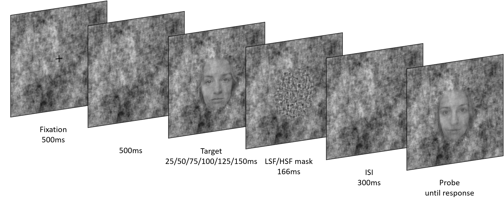

# CtF_behavioural_project
In this experiment we test behavioural implications of coarse-to-fine masking of faces.

The paradigm is a delayed matching task:
We present a full spectrum face (50/75/100/125/150ms), whereafter we mask (phase scrambled low or high SFs) and then present a second face (same or different identity).
Subjects have to indicate whether the first face has the same identity as the second.

We manipulate the visibility of the faces by blending the face with the background image.
By using a staircase procedure, we can determine at which signal level the participant can preform the task above chance-level.

If backward masking is very disrupting, the signal is expected to be high at the end of the experiment.
If the masking is not as disruptive, the final signal will be lower.

Experimentcodes in MainExp_code:
- CtFBackwardMasking.py is the main experimental code
- functions_ctfbackwardmasking.py contains functions/methods specific to the experiment
- JS_psychopyfunctions.py are functions usefull for psychopy experiments (can be re-used)
- PsiMarignal.py is the staircasing function by N. Niehof

Make sure the MainExp_code folder contains the following folders:
- stimuli : containing stimuli with ID00_IM00.bmp naming
- background : containing masks with BG00.bmp naming
- masks : with LSF or HSF masks called BG00_ID00_IM00_LSF.bmp
- data : for saving the logfiles

Stimuli_matlab contains stimulus processing codes
